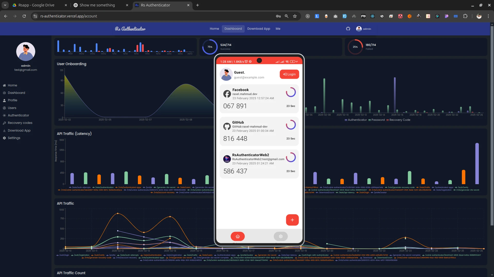

# Rs Authenticator (Android App) 

Here's a rearranged version of your content for better flow and clarity:

---

**RS Authenticator** is a secure and user-friendly authentication application designed to manage your Multi-Factor Authentication (MFA) codes. It ensures that your accounts remain safe and provides a seamless experience for setting up and managing your 2FA codes.

Built with **Kotlin (Jetpack Compose)**, RS Authenticator supports the **TOTP protocol** and algorithms such as **SHA1**, **SHA256**, and **SHA512**, based on your client secret.

### Key Features:
- **Support for TOTP Protocol**: RS Authenticator supports the **Time-Based One-Time Password (TOTP)** protocol, widely used for generating one-time passwords.
- **Algorithms for TOTP**: Choose from multiple algorithms for generating TOTP codes, including **SHA1**, **SHA256**, and **SHA512**, based on your requirements.
- **Secure Authentication**: Advanced encryption techniques are used to protect user data and ensure secure authentication processes.
- **QR Code Generation**: The app generates QR codes for easy scanning and verification of your MFA codes.
- **App Lock**: Secure your app with a built-in lock to prevent unauthorized access, keeping sensitive data safe even if your device is lost or stolen.
- **Offline Operation**: The app works fully offline, allowing you to continue using it even without an internet connection.
- **Offline Data Backup**: Back up your data offline without needing internet access, ensuring you can restore it securely at any time.
- **Secure & No Tracking**: Your privacy is our priority. Your data is stored only on your device, with no tracking or sharing, giving you full control over your information.

---

 
# About the Project (Web)

The backend of RS Authenticator web is built using **Golang**, which leverages **PostgreSQL** to securely manage user data, authentication sessions, traffic logs, recovery codes, and MFA connection secrets. This robust backend provides a scalable and secure solution for handling user authentication needs.

Key backend features include:
- **Image Uploads**: Profile photos are efficiently uploaded and stored via **Cloudinary**, minimizing server load and optimizing image handling.
- **Design Pattern**: The **Chain of Responsibility** design pattern is used to enhance code reusability and maintainability. This approach splits and reuses handlers for specific tasks, reducing redundancy and improving modularity.
- **Caching**: Caching mechanisms are integrated into selected endpoints and repositories to reduce database load, improve performance, and ensure faster response times.

### Frontend Features

The frontend offers the following functionalities for a smooth and effective user experience:
- **Registration Trends**: Insights into user registration activities.
- **Login Methods Breakdown**: View the ratio of login attempts using passwords versus the Authenticator App.
- **Account Recovery Codes**: Manage recovery codes for securing accounts.
- **Authenticator Success/Failure Counts**: Track the success and failure rates of authentication attempts.
- **API Traffic Analytics**: Monitor API traffic for performance insights.
- **API Latency Monitoring**: Track the latency of your API for optimal system performance.

### See It in Action
Check out a video overview of the app to see how it works in real-world scenarios.
[rs-authenticator-2.mp4](frontend/public/rs-authenticator-2.mp4)

## How to Set Up MFA Authenticator

Multi-Factor Authentication (MFA) is an important security feature that adds an extra layer of protection to your accounts by requiring a second form of verification.
Here's an enhanced version of Step 1:

---

### Step 1: Setting Up the App
1. Download the **RS Authenticator App** from our [Download Page](https://rs-authenticator.vercel.app/download-app).
2. **Log in** to the application where you want to enable Multi-Factor Authentication (MFA).
3. Navigate to the [**Enable MFA**](https://rs-authenticator.vercel.app/account/authenticator-apps) section in your account settings. In this section, you'll find an **Add Provider** button that generates a new QR code for the authenticator connection.
4. **Scan the QR code** with the RS Authenticator app to link your account.
5. Finally, click the **Complete Setup** button to finalize the configuration and activate MFA for your account.

---

## License
This project is licensed under the MIT License.
